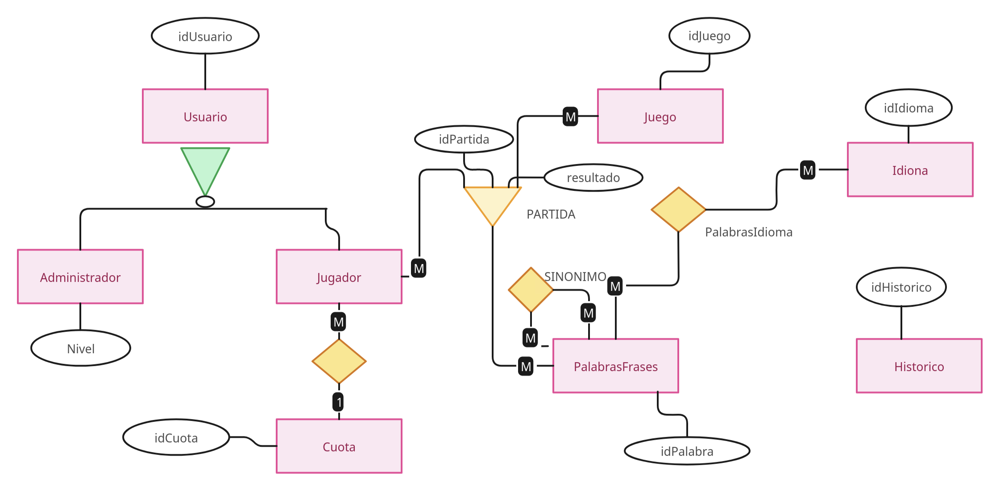
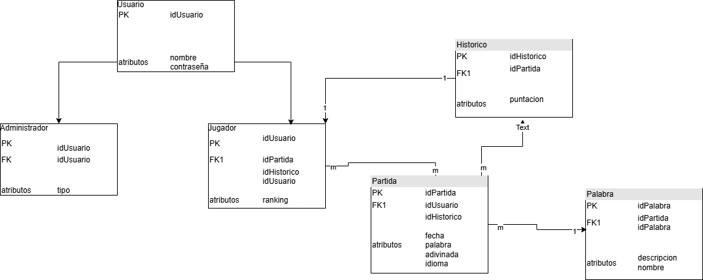
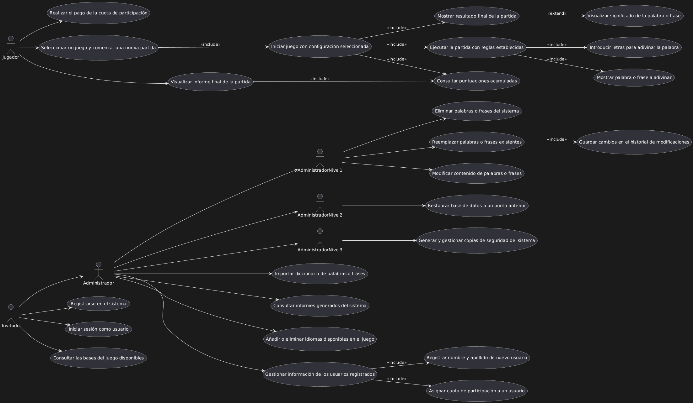
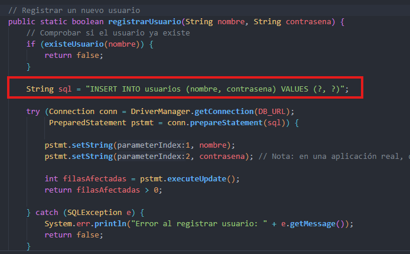
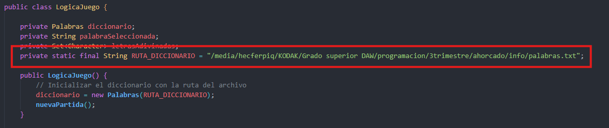
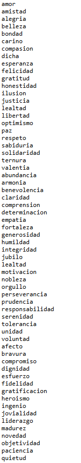
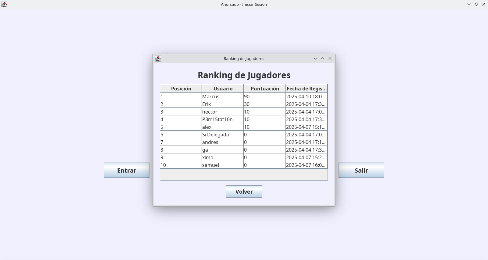
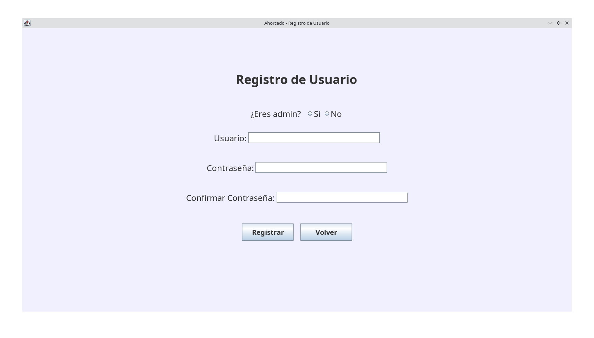
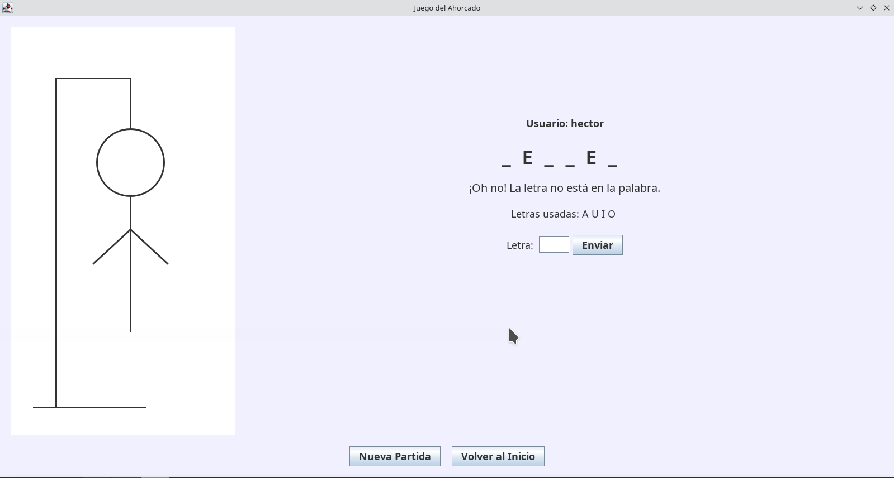

<div align="center">
    

</div>
<br>

# 📌 "Juego del ahorcado"

## 🎮 Introducción

Implementacion de un juego del ahorcado en lenguaje Java, practicando el crear metodos, objetos en verias clases impiortando archivos de txt con palabras e implementacion de una base de datos para gestionar usuarios con un ranking y puntuacion.

---


## 🚀 Implementación en Java con Interfaz

### 🔹 Tecnologías a Utilizar
- **Java** ☕
- **Swing** 🖥️ para la interfaz gráfica
- **Informacion** SQLite, archivos .txt
- **IntelliJ** como editor
- 


---

## 🗂️ 1.0 - Diagrama Entidad-Relación (E-R)

Este diagrama ha sido proporcionado por el profesor:
<br>

<br>

Este ha sido como voy a basar mi juego he eliminado hacer una tabla para idiomas simplemente sera un atributo, el historico lo he unido de forma que al acabar la partida se guarda directamente el resultado.
<br>



Este es el diagrama UML de actores.
<br>




---

## 📝 2.0 - BASE DE DATOS SQLite  


La base de datos del juego deberia verse algo tal que asi:


-- Crear tabla Usuario
```
CREATE TABLE Usuario (
    idUsuario INT PRIMARY KEY,
    nombre VARCHAR(100),
    contraseña VARCHAR(100)
);
```

-- Crear tabla Administrador
```
CREATE TABLE Administrador (
    idUsuario INT PRIMARY KEY,
    tipo VARCHAR(50),
    FOREIGN KEY (idUsuario) REFERENCES Usuario(idUsuario)
);
```

-- Crear tabla Historico
```
CREATE TABLE Historico (
    idHistorico INT PRIMARY KEY,
    idPartida INT,
    puntuacion INT
);
```

-- Crear tabla Partida
```
CREATE TABLE Partida (
    idPartida INT PRIMARY KEY,
    idUsuario INT,
    idHistorico INT,
    fecha DATE,
    palabra VARCHAR(100),
    adivinada BOOLEAN,
    idioma VARCHAR(50),
    FOREIGN KEY (idUsuario) REFERENCES Usuario(idUsuario),
    FOREIGN KEY (idHistorico) REFERENCES Historico(idHistorico)
);
```

-- Crear tabla Jugador
```
CREATE TABLE Jugador (
    idUsuario INT PRIMARY KEY,
    idPartida INT,
    idHistorico INT,
    ranking INT,
    FOREIGN KEY (idUsuario) REFERENCES Usuario(idUsuario),
    FOREIGN KEY (idPartida) REFERENCES Partida(idPartida),
    FOREIGN KEY (idHistorico) REFERENCES Historico(idHistorico)
);
```

-- Crear tabla Palabra
```
CREATE TABLE Palabra (
    idPalabra INT PRIMARY KEY,
    idPartida INT,
    descripcion TEXT,
    nombre VARCHAR(100),
    FOREIGN KEY (idPartida) REFERENCES Partida(idPartida)
);
```

-- Añadir clave foránea a Historico para la relación con Partida
```
ALTER TABLE Historico
ADD CONSTRAINT FK_Historico_Partida
FOREIGN KEY (idPartida) REFERENCES Partida(idPartida);
```

-- Añadir tabla de relación para la relación muchos a muchos entre Palabra y Partida
```
CREATE TABLE Palabra_Partida (
    idPalabra INT,
    idPartida INT,
    PRIMARY KEY (idPalabra, idPartida),
    FOREIGN KEY (idPalabra) REFERENCES Palabra(idPalabra),
    FOREIGN KEY (idPartida) REFERENCES Partida(idPartida)
);
```

---

#  3.0 Conectar la base de datos con Java. 

Mediante el uso de Maven, de moomento acepta registros y los guarda en la BBDD sentencia: 
<br>

<br>

Enlazamos un archivo .txt con 200 palabras en Español de momento:
<br>

<br>

Ejemplo de las palabras:
<br>



##  4.0 - INTERFAZ GRAFICA
### 4.1 - Principal
.png)

### 4.1.1 - Ranking


### 4.2 - Registro normal


### 4.2.1 - Opcion registro admin
.png)

### 4.3 - Menu
.png)

### 4.3.1 - Opcion jugadores
.png)

### 4.3.2 - Opciones admin
.png)

### 4.4 - Juego



---
🎯 **Próximo paso:** 

Ranking (historico), implementacion mostrar letras usadas, mejoras visuales, añadir idiomas, añadir administraador con roles especiales.

